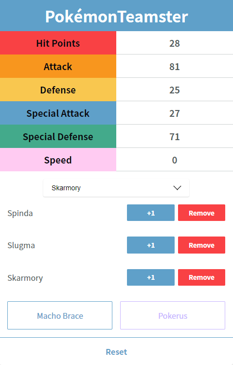

# PokéTeamster

  

PokéTeamster is a web application focused on tasks such as tracking EVs, calculating IVs, as well as providing useful information for building the perfect Pokémon team.

## Features
- Enable Macho Brace and Pokérus for accurate EV gain.
- Create a list of Pokémon from which you are battling.
- Track EVs based on the wild Pokémon in your list.

## Note

PokéTeamster is currently in Open Beta and therefore has minimal functionality and may include bugs. If you notice any bugs, please create a **GitHub issue** on the repository. If you would like to see more feautres or would like to implement them yourself, send a **pull request**!

## Planned Features
- Display the EV gain from a wild Pokémon in the list.
- Select which generation you are currently playing for more accurate EV items and Pokémon.
- Implement target EVs so that the user can see how many EVs they have left (QOL).
- Iron out any bugs and graphical issues.

Thank you for supporting this EV tracker! I hope to implement an IV calculator at some point in the future to accompany this tool.